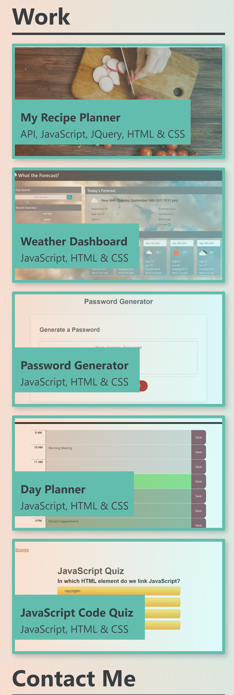

# Portfolio Prototype

## Link to Deployed Page

https://jl118.github.io/h2_portfolio/

## Overview

This is the prototype for my portfolio made with HTML, JavaScript, and CSS.

Utilizing media queries, it is responsive across most mobile devices.

## About the Page

* The header highlights the developer's name, and also contains a navigation bar to jump to different sections of the page, as well as space to link to a resume. This navigation bar changes to a 'burger' link for mobile devices, with the links sliding into view from the right side of the page. 

* A hero below the navigation bar can be swapped for a photo, or an aesthetic image that shows the developer's interests and personality.

* The body has an 'About Me' section to let people know who you are and cards linking to key projects, complete with linear gradients and hover effects for visual appeal. 

* The footer contains a customizable 'Contact Me' section with links to standard social media platforms. 

## Layout

* Desktop Layout:
    

* Mobile Layout:
    

    

